# Easy Skincare

## Table of Contents
1. Project purpose and introduction
2. UXD – User Experience Design
3. Features
4. Technologies and Resources used
5. Testing
6. Project barriers and solutions
7. Version Control
8. Deployment
9. Credits
10. Acknowledgments

# 1. Project purpose and introduction

This complex project was created to demonstrate the acquisition of broader coding skills as part of the Code Institute Fullstack Web Developer Course. Technologies used during the application development process are mainly: **HTML, CSS, JavaScript, Python + Django** with an additional framework such as **Bootstrap**. In addition, to handle the payments section for this site, **Stripe** handles online tests were used and as a relational database accordingly **Heroku Postgres**. This project aims to create a full-stack e-commerce application that allows users/shoppers to view a full assortment, add products to the shopping bag, make a secure purchase, leave a review for products, create a wishlist, store personal data for orders, and get e-consultation via email. For store management application allows manipulating easily through the products database, meaning adding, editing/updating, deleting items. 

# Easy Skincare 

[**Please, to view the live project ---> Click Here**](https://easy-skincare.herokuapp.com/)

Easy Skincare is a full-stack application for a non-existing/fictional brand, that allows users to interact on the page. The purpose of this app is to demonstrate and search for skincare products, add reviews, contact for consultation. This app can benefit skincare enthusiasts who like to experiment with products with clear INCI lists and are recommended by dermatologists. The website offers the possibility to users to store their data for later orders, add products to the wishlist, and make a secure purchase. This website is designed in such a way that the user can check it at any time, and on any device, like on the phone/tablet on the road, or at home on the computer. This project may be expanded successfully in the future with other, more detailed categories and services. 


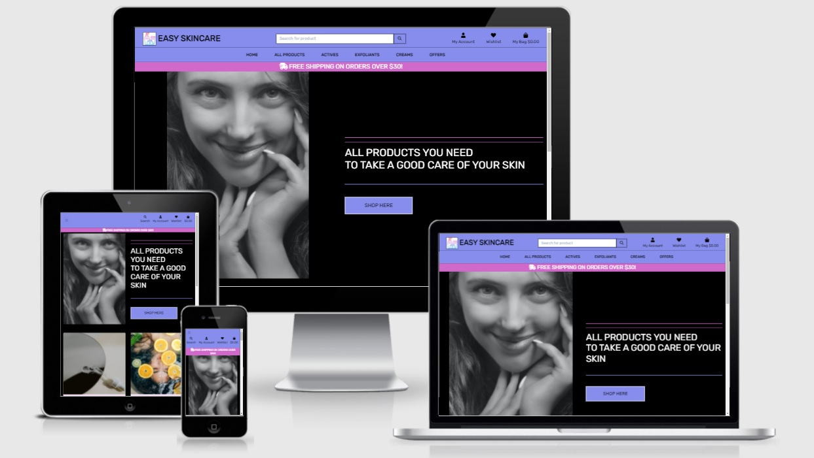


# 2. UXD – User Experience Design


### **Strategy**


Potential users of this application are users who have a professional and hobbyist interest in skincare products as well as everyone who has their own skin concerns and issues. The site can be very handy for users with basic knowledge of beauty products on the market and customers who want to be sure that by adding products to the basket they are buying something that was checked and recommended by specialists, cosmetologists, and dermatologists. The site will benefit also users who have already professional skills in advising just to compare the products and be sure that they are valuable on the market and safe to use according to the clarity of ingredients lists and simplicity to include them in daily routines.


### **User Stories**

> Site Owner Stories 

- As a store owner, I wish to be able to add products easily, so that I can add new items to my store at any time
- As a store owner, I wish to be able to edit and update a product, so that I can change product prices, descriptions, images, and other products criteria when needed 
- As a store owner, I wish to be able to delete a product, so that I can remove items that are no longer available for sale
- As a store owner, I want to be able to provide the best services for secure payments, recommendations, and professional consultation, so that I can achieve customer satisfaction on the highest level and possibly beneficial upsell of products

> Customer/Shopper Stories 

- As a shopper, I wish to be able to view a list of products, so that I can select some interesting items to purchase
- As a shopper, I wish to be able to view individual product details, so that I can identity the price, description, product rating, product image, and have a possibility to add it to the wish list, and leave or read a review
- As a shopper, I wish to be able to quickly identify offers, and available kits and consultations, so that I can take and advantage of special savings on products and choose correctly the product I would like to purchase
- As a shopper, I wish to be able to easily view the total of my purchases at any time, so that I can control my shops and avoid spending too much
- As a shopper, I wish to be able to sort the list of available products, so that I can easily identify the best rated, best priced, and categorically sorted products
- As a shopper, I wish to be able to sort a specific category of products, so that I can find the best-priced or best-rated product in a specific category, or sort the product in that category by name
- As a shopper, I wish to be able to sort multiple categories of products simultaneously, so that I can find the best-priced or best-rated products across broad categories
- As a shopper, I wish to be able to search for a product by name or description, so that I can find the product I wish to buy according to my personal needs
- As a shopper, I wish to be able to easily see what I have searched for and the number of results, so that I can quickly decide whether the product I want is available
- As a shopper, I wish to be able to easily select the quantity of a product, so that I can ensure I do not accidentally select the wrong product numbers of items
- As a shopper, I wish to be able to view items in my bag to be purchased, so that I can identify the total cost of my purchase and all items I will receive before moving to the final checkout
- As a shopper, I wish to be able to adjust the number of individual items in my bag, so that I can easily make changes to my purchase before checkout
- As a shopper, I wish to be able to easily enter my payment information, so that I can check out quickly and with no hassles
- As a shopper, I wish to be able to feel that my personal and payment information is safe, and secure, so that I can confidently provide the needed information to make a purchase
- As a shopper, I wish to be able to view an order confirmation after checkout, so that I can verify that I have not made any mistakes in my order
- As a shopper, I wish to be able to receive an email confirmation after checking out, so that I can keep the confirmation of what I have purchased for my records

> Site User Stories 

- As a user of a website, I wish to be able to navigate through very easily, so I can find interesting content
- As a user of the website, I wish to be able to understand the purpose of the application, so I can gain brief orientation about what I can achieve by using it
- As a user of the website, I wish to have visible access to social media, so I can follow after site owners/admin to receive some deals, events and offers info 
- As a user of the website, I wish that design is responsive, so I can look at the page on different sizes of devices
- As a user of the website, I wish to have the possibility to create a review, so I can share an opinion about the product with other users
- As a user of the website, I wish to have the possibility to create my own wishlist, so I can save my favorite products of choice for later
- As a user of the website, I wish to be able to easily register for an account, so that I can have a personalized account and be able to view and update my profile
- As a user of the website, I wish to be able to easily login or logout, so that I can access my personal account information and update them if needed
- As a user of the website, I wish to be able to easily recover my password in case I forget it, so that I can recover access to my account
- As a user of the website, I wish to be able to receive an email confirmation after registering, so that I can verify that my account registration was successful
- As a user of the website, I wish to be able to have a personalized user profile so that I can view my personal order history and order confirmations, and save my payment information

### **Scope**

Current and further developing and designing skill ability, the website provides:
- Clean User Experience by using technologies mentioned in the introduction - HTML, CSS, JavaScript, Python + Django, Stripe, Heroku
- Easy and intuitive navigation via the navbar with dropdown categories of products and services, and a toggle button for the mobile version
- Informative content builds to give a clean and modern impression of the purpose of the website 
- Responsive design allows navigating on different devices
- Interactive features which are focused on providing a functional and appealing space for the user (buy button, wishlist, review, bag, account with profile, checkout)
- Landing page with the hero image, introduction paragraph, shop button. Introduction content below with philosophy, services, and pieces of advice 
- Pieces of key information about each product, like description, rating, price, image
- Clear and simple searching bar to browse for products and keywords
- Informative and simple steps of making a secure purchase, add items to the bag, form for personal and payment information, a list with order details and confirmation
- Wishlist for storing favorite products in one place, and the possibility to give review for a product of choice
- Clean information on how and where to log in and use the profile as a registered user
- Secure log out feature possibility to store data safely
- The simple mean of how to create, add, edit and delete an item - reserved for the Management Production only 
- Footer with social media icons to link to their sites, and important disclaimer 


### **Structure**


The structure of the application is based on meeting the first needs of the potential user. The website is simple structured, learnable, and intuitive, the first interaction enables the quick and easy finding of information and orientation between features and theme. The text content is short and consistent and the imagery is simple and clean, both describe the purpose and aim very well. All sections allow the user to interact with the site using built-in functions.

All users of the website should be able to see the navigation bar, with clickable options, clear and modern content on each part, and a footer with standard information. The visual impression and design should be also consistent across all pages of the app.
- **Navigation Bar** on the top of the page which is consistent  - contains a logo image and brand name which acts as a link to the main page, search bar, names with icons of each site page for browsing easily between them, toggle button visible on smaller devices. On the bottom of the navigation bar, categories of products with a dropdown menu for each to browse between detailed subcategories
- **Home/About Page** - contains a short introduction paragraph, hero image, and shop button, below collection of cards with the theme of the site, purpose, and philosophy of brand and guidance about easy skincare routines, as well as e consultation button directing to purchase a service 
- **All Products** Page - contains card panels with the presentation of products, each card contains an image that acts as a clickable button for the further view of the full product details, name, price, rating info, category name of the product
- **Product Detail** Page - actually a multitask page that gives a users possibility for interaction, contains name, price, and full description about the product, provides also add to wishlist button, add to bag button, and add review button 
- **Register Page** - contains fields to fill up with 'Username' and 'Password' and a 'Register' button, and a link to the 'Log In' Page
- **Log In** Page - contains fields to fill up with 'Username' and 'Password' and a 'Login' button, and a link to the Register Page
- **Profile** Page - contains personal information about a user, delivery details, and order history, this page is available for registered users
- **Log Out** link - allows user to log out from the profile to protect a  stored data
- **Shopping Bag** Page - contains an image and name of the product, price, quantity, grand total information, as well as continue shopping and secure checkout buttons for more actions
- **Wishlist** Page - contains information about favorite products stored by the user 
- **Checkout** Page - contains a form for details, delivery, and payment information, adjust bag and complete order buttons, and order summary with image, name, quantity, subtotal, delivery, and grand total information
- **Footer** on the bottom of the page which is also consistent - contains icons that act as a link to SM platforms, email address to contact the store


### **Skeleton**

[**Wireframes:**](docs/wireframes/MS4_Wireframes.pdf)

A website with different separate content pages and the possibility to navigate between them
- Header – fixed navigation bar with logo, brand name, and clickable dropdown links for product categories, search bar for browsing keyword
- Sections called:
    - Home (considered also as About page) - introducing the user to the purpose of the store 
    - All Products page, and further main categories pages 
    - My account with dropdown for log in, register, log out, profile, admin links
    - Wishlist for storing favorites products 
    - Shopping bag and further checkout page for purchasing products
- Footer – a footer with social media icons, email, disclaimer, and copyright

[**Database:**](docs/database/ERD_for_MS4.pdf)

A database created for this project consists of models for:
- categories
- products
- users
- users profile
- orders
- order items
- wishlist
- reviews 

Database for products and categories was chosen, collected and basically self-written/self-created only for the purpose of this particular project (disclaimer for imagery, names, descriptions, and all information included, can be found in the Credit section of this file). During the development process for that purpose was used SQLite and during the production process Heroku Postgres. The database idea for products was taken from a walkthrough project by Code Institute by first creating JSON files and store them in the fixtures folder in the products app. Database documenting models is shown in a separate diagram above. 

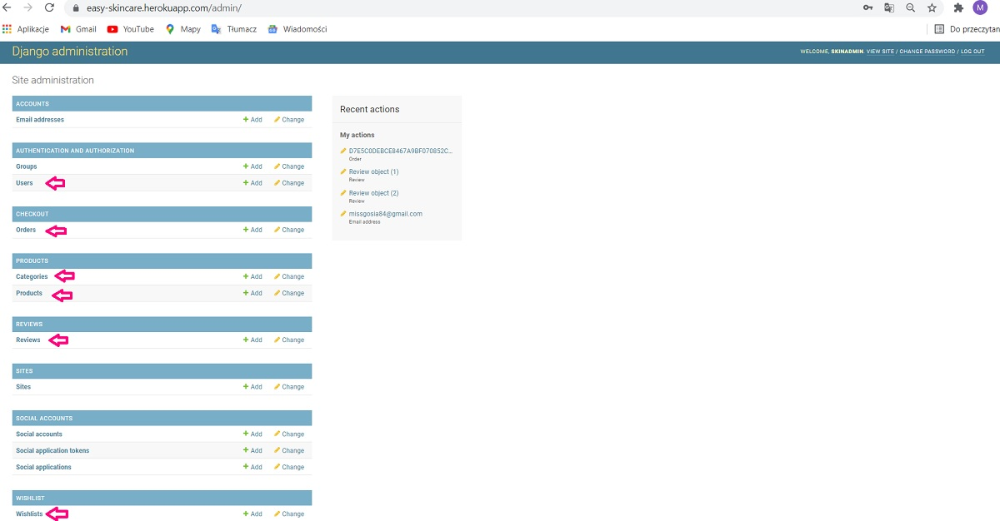


### **Surface**

The visual experience of this project reflects the theme of candy or toy shops. The main purpose of this kind of choice and way of connecting it was to present a happy, modern, and clean design that creates a trustful and comfortable space for customers, important from a psychological point of view if it is about the selling part in each business. 

> Colors

A contrasting blend of a dark background and pastel colors for the features reflecting the classic elegance and simplicity. On the other hand white fields for the forms are easy to look at and show clearly core pieces of information. Throughout the whole project, main colors were picked from coolors.co, after matching them with the brand logo, in addition, lighter shades of the main colors have been found to apply them to the cards body and toasts. 


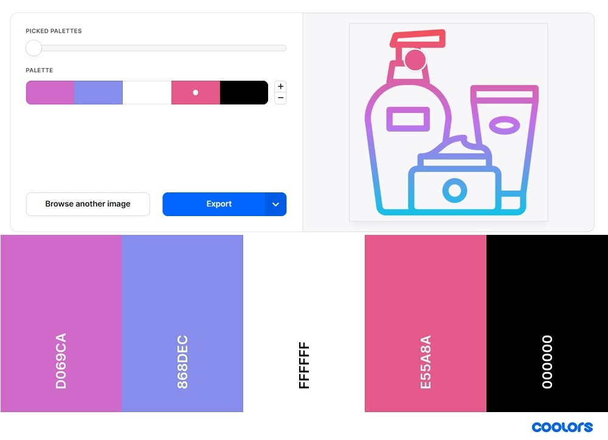


> Typography

Font 'Rubik' was used for the clean and transparent experience for the whole body content. Selected from Google Fonts after recommendations other developers as one of the top 20 for e-business. This specific one is good for clear readability and the professional layout of the e-commerce store with beauty products.

> Icons 

Icons for cards content and Bag, Account, Wishlist, and Social Media links picked from Font Awesome free collection, the web's most popular icon set, and toolkit. 

> Images 

The selection of images for the website was taken from several sources. Imagery collections for home page content were picked from Unsplash and Pixabay, and imagery for products was taken from official producents websites, explanation and credentials below in this document, designed for educational purposes only. 
Imagery presentation shows to users the exact theme of the website making it understandable from the first impression. The hero image on the Home Page reflects standard healthy skin imagination and the generally understood concept of beauty. 

> General Design

During the development process, the design several times had to be changed. A core part of design solutions was borrowed also from the walkthrough project as a base. However, I wanted to create a clear, simple but strong, visible, and colorful impression for the user's experience. I have decided on a specific blend of colors. The home page was rebuilt several times until met my expectation in a compromising way. There is a lot to improve later in the future design which is probably not my strong side yet. The limit of time, unfortunately, stopped me from experimenting in that matter as long as functionality became here a main priority. 


# 3. Features

> Existing Features shown across the pages

Existing features on the site were created for making the User's Experience easy and intuitive. Application is clear to understand, as a first visible is the purpose of the website which is reading, shopping, storing data, and sharing reviews with others. Space created for users is very simple and comfortable, all features are clearly specified and pointing users to take further steps. The navigation bar and footer are consistent and act as a present component on every page which makes navigation smooth. Name of separate pages acts as active links and brings users to different parts of content and experiences. 

- **Top Navigation Bar** - Implemented navbar is a visible element on every page and is fully responsive so that users can browse across the site smoothly. If a user has something in the bag the cost of the current shops' displays on the screen.

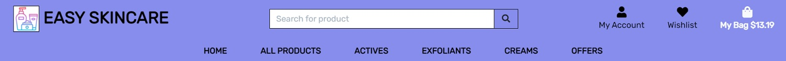

- **Search Bar** - Users have the possibility for search function within the navigation bar to search for products names or descriptions, the result displays a simple active link that redirects the user to the all products page.

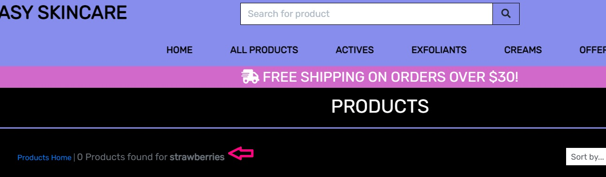

- **Home/About Page** - Home/About page features acts as an introduction to the site, hero image with shop here button, and cards panels with a philosophy of easy and simple skincare routines.
  
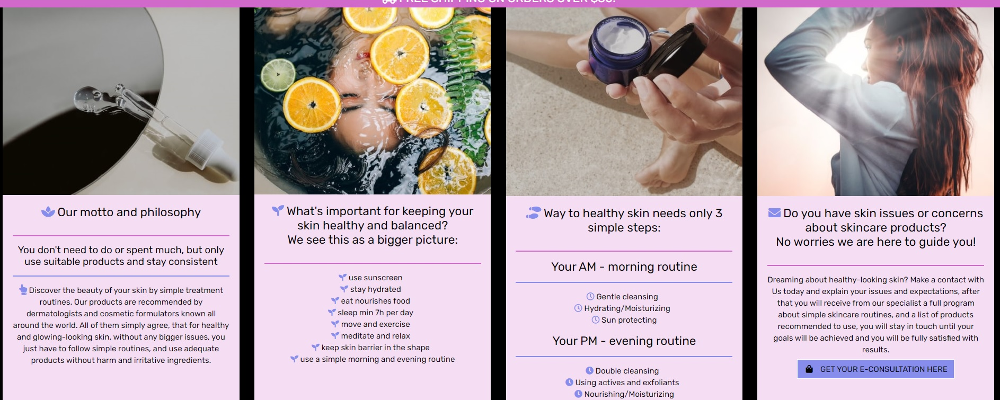

- **Alerts/Messages** - Bootstrap toasts providing feedback to the user after clickable actions related to the products. Shoppers can have control all the time when they are interacting with the page, like a number of items in the bag, and total cost, update that some product was successfully added or deleted, button to the checkout and calculation for a free delivery option over spending a specific amount of money.

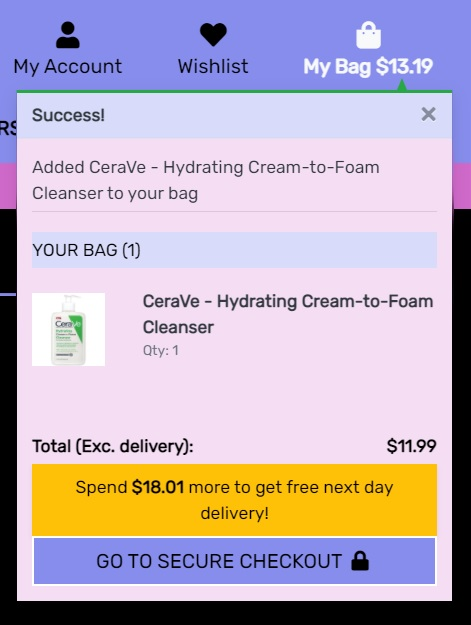

- **Products Store** - The Shop page displays all products on large resolutions in a row of four, and mobile screens in a row of one. Standard card layout gives a clean user experience with visible elements, and clicking the image will bring the user to the product detail page.

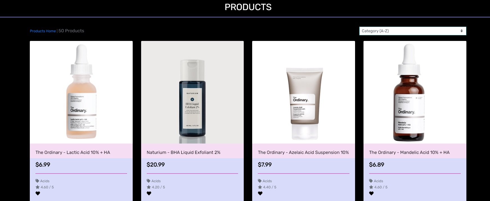

- **Register/Login/Logout Pages** - those features allow the user to  sign up to the page to create a profile, to log in as a coming back customer in the future, and log out to safe data for later under protection from outside, authentication for a user is being provided
  
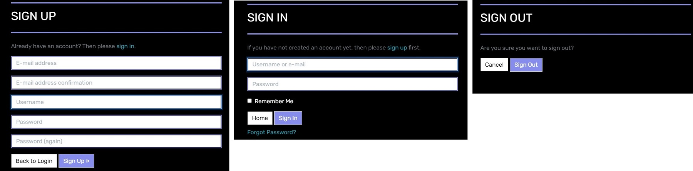
  

- **Profile Page** - Contains all prefilled information about user name, county, postcode, street, and whole order history with a possibility to check back for previous orders, user can update their data about themself and delivery, only authenticated/authorized users have access to this feature.

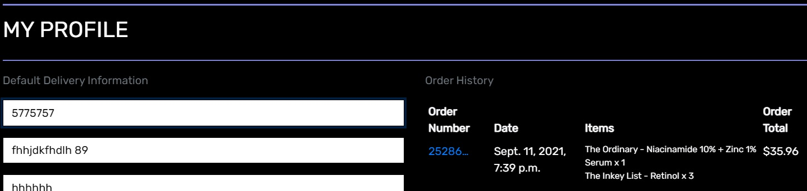

- **Shopping Bag** - The shopping bag page is fully responsive, showing users a product picture, name, and total price, users can also use the update link to increase or decrease the number of products in their bag or delete link to remove it from bag. All prices are provided, like total and delivery cost and information about free delivery or how much more needs to be spent to get free delivery. 

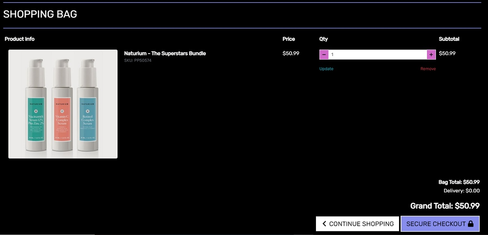

- **Footer** - Contains Social Media icons that act as links for Facebook, Instagram, and YouTube and bring the user to the main platforms. In the future should bring the user to real social media provided by the community. Links open in a new tab so that the user can smoothly navigate back to the application. Added also email Icon, that directs to the postbox, in the future real contact feature will be provided and expanded. 

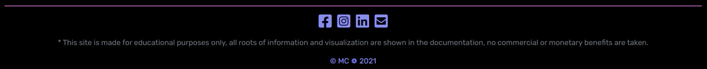

> Features left to implement in the future when skills developed

- Definitely in future great idea would be to add much more products to the store together with more categories of products.

- The application could have a blog to provide posting and exchanging opinions about new technologies in skincare, new and existing products, and advice about how to treat different skin issues and results achieved after recommended treatment.

- It would be nice to include video consultations so that users can meet up with specialists and get their bits of advice about products and recommended routines.

- Create a contact form that is avaliable directly from this app for easier user experience. 

# 4. Technologies and Resources used 
* [**Code Institute Fullstack Web Developer Course Content**](https://codeinstitute.net/) - was used as the main source of fundamental knowledge and inspiration.
* [**Code Institute „SLACK” Community**](https://slack.com/intl/en-no/) - was used as a source of assistance.
* **HTML - HTML5 technology** – was used as the main language to create the structure of the Website.
* **CSS - CSS3 technology** – was used as the main language to style the Website.
* **JS - JavaScript technology** – was used as the main language to create the interactive elements of the Website.
* **Python technology** - was used as an interpreted high-level general-purpose back end programming language
* [**Django**](https://www.djangoproject.com/) - Django the web framework for perfectionists with deadlines.
* [**Jinja**](https://jinja.palletsprojects.com/en/3.0.x/) - a web template engine for the Python programming language
* [**Bootstrap**](https://getbootstrap.com/) - Bootstrap is a free and open-source CSS framework directed at responsive, mobile-first front-end web development.
* [**jQuery**](https://jquery.com/) - the jQuery library was used as an open-source to create interactive features.
* [**Font Awesome**](https://fontawesome.com/) - Font Awesome Icons were used for social media links and marking separate parts of sections.
* [**Google Fonts**](https://fonts.google.com/specimen/Inconsolata) - Google Font used throughout this project
* [**Gitpod**](https://www.gitpod.io/) - Integrated Development Environment was used to develop the Website.
* [**GitHub**](https://github.com/) - GitHub hosting site was used to store the source code for the Website, and Git Pages was used for the deployment of the live version of site.
* [**Git**](https://git-scm.com/) - Git was used as version control software to commit and push code to the GitHub repository where the source code is stored.
* [**Heroku**](https://www.heroku.com) - Cloud Application Platform is a service (PaaS) that enables developers to build, run, and operate applications entirely in the cloud
* [**Stripe**](https://stripe.com/en-no) - an Irish-American financial services and software which offers payment processing software and application programming interfaces for e-commerce websites and mobile applications.
* [**Amazon Web Services**](https://aws.amazon.com/) - subsidiary of Amazon providing on-demand cloud computing platforms and APIs to individuals, companies, and governments, on a metered pay-as-you-go basis.
* [**Stack Overflow**](https://stackoverflow.com/) - was used as a general source of knowledge.
* [**w3schools**](https://www.w3schools.com/howto/default.asp) - was used as a general source of knowledge.
* [**Google Chrome Developer Tools**](https://developers.google.com/web/tools/chrome-devtools) - this built-in developer tool was used to inspect page elements and help debug issues with the site layout and test different styles
* [**Mobile-Friendly Test Tool**](https://search.google.com/test/mobile-friendly) - The Mobile-Friendly test tool was used to check if an application is designed for mobile devices.
* [**Balsamiq Wireframe**](https://balsamiq.com/wireframes/) - these quick and handful tool was used to create wireframes for planning project structure and layout.
* [**Lucidchart**](https://lucid.co/product/lucidchart) - The intelligent diagramming application for every team
* [**Am I Responsive Bookmarklet**](http://ami.responsivedesign.is/) - Multi Device Website Mockup Generator was used to create the Mockup image for this README file.
* [**Make a README**](https://www.makeareadme.com/) – a page that shows suggestions on how to create a good Readme file.
* [**Mastering Markdown**](https://guides.github.com/features/mastering-markdown/)– GitHub guide about Markdown. Lightweight and easy-to-use syntax for styling all forms of writing on the GitHub platform.
* [**W3C Markup Validation Service**](https://validator.w3.org/) - validator was used to check the markup validity of content in HTML and CSS.
* [**JSHint**](https://jshint.com/) - was used as tool that helps to detect errors and potential problems in JavaScript code.
* [**Json Formatter**](https://jsonformatter.curiousconcept.com/) - was used as json file formatter and validator
* [**Json Online Viewer**](https://countwordsfree.com/jsonviewer) - was used to display json file tree view for data base fixtures 
* [**PEP8 online**](http://pep8online.com/) - was used as tool check the code for PEP8 requirements
* [**Closing Tag Checker for HTML5**](https://www.aliciaramirez.com/closing-tags-checker/) - was used to validate if all tags are open and close correctly.
* [**HTML and CSS and JS Formatter**](https://webformatter.com/html) - Free online tool to format an ugly HTML code, making it readable and pretty, with the proper indentation.
* [**Black**](https://black.vercel.app/) - The uncompromising Python code formatter.
* [**TempMail**](https://temp-mail.org/) - used to create temporary email adress for testing part
* [**Grammarly**](https://app.grammarly.com/) - a comprehensive writing tool was used as a helper to write clear and correct text.
* [**FaviconeCodeGenerator**](https://www.faviconcodegenerator.com/) - Favicon Code Generator is Free Online Favicon Converter and has been used to create a little graphic image (icon) associated with a webpage.
* [**Coolors**](https://coolors.co/image-picker) - The super fast color schemes generator was used to create a color pallet for project from photo/logo image
* **Microsoft Paint** - a simple raster graphics editor has been used for editing and resizing pictures.

# 5. Testing

The final result of this project is a full-stack, front-end and back-end web application based on the principles of user experience design, accessibility, and functionality. 
**This is an interactive front-end and back-end web application developed and implemented by using HTML, CSS, JavaScript, Python+Django, with additional Bootstrap elements**, so required testing was conducted based on functionality for getting and storing data, visual effects, website layout, and interactive actions which user can take during navigation and purchasing products.

**General manual and further testing results, like user stories, CRUD, code validation :** ---> please click [**HERE**](tests.md)


# 6. Project barriers and solutions

- After inserting the home page index.html into the code validator error has been found, and fixed by simply removing `<br>` tags and adding `d-block` classes for the `<li></li>` tags instead, just to display all elements in separate lines inside card body.

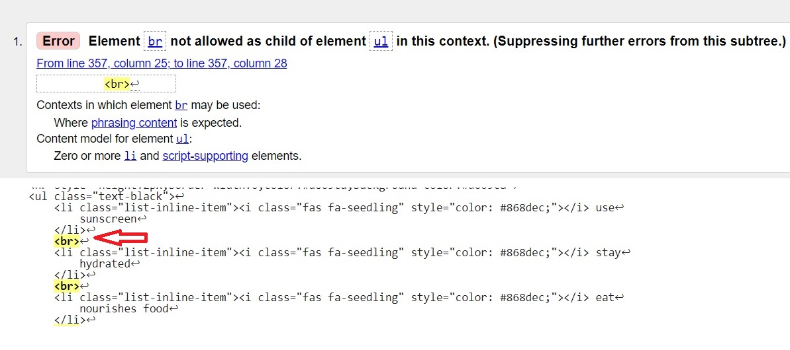

- After inserting code into the code validator another error has been found, this time about a duplicate id at the navigation bar, while opening a page both navigations for mobile view and for desktop view will load as one template,  and only one id is allowed in that case, because after convention it has to be unique, it was repeated after found in base.html so I changed id="user-options" and its label, for an id="user-options-mobile" in mobile-top-header.html template to make that work.

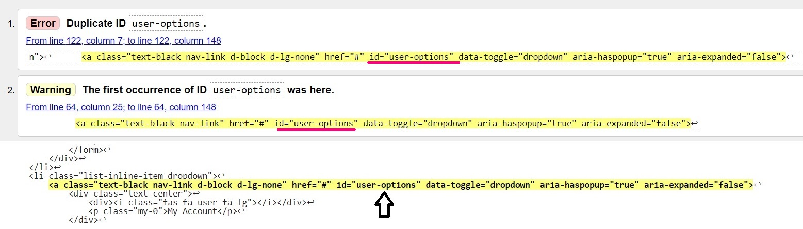

- Problems occurred with the middle page hanging footer when displaying separate sites with very little content, like an empty wishlist, or empty bag, or template to sign in or log out. I tried several solutions investigated on pages with CSS tricks and stack overflow, none was perfect in that matter. After I spoke with my Mentor during one of the sessions, I find out that the simplest solution would be to wrap a whole content in base.html in a `div and add a class="content"`, and then refer to it in CSS by using `.content` selector with property `min-height` and its value `100vh`. That worked for this case.

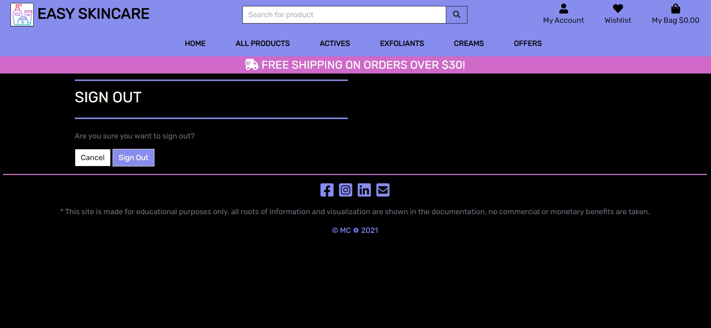

- During the deployment application to the hosting platform, when I was trying to connect the database to Heroku Postgres, after trying to show migrations, an operational error occurred, after a recommendation in the tutorial to fix this bug I ran the following command in terminal: `unset PGHOSTADDR`, and that worked.

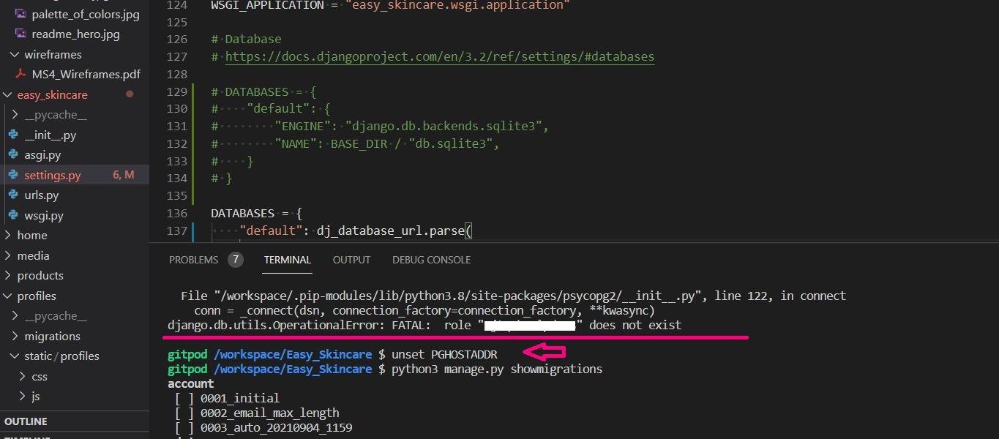

- Right after, while trying to temporarily disable collect static so that Heroku will not collect them when the app is deployed by running command `heroku config:set DISABLE_COLLECTSTATIC=1`, I got an 'Error: Missing required flag -a, --ap APP' info in a terminal which says that 'Error: EACCES: permission denied, open...error.log', so after following instructions provided in terminal, I had to repeat action by using command `heroku config:set DISABLE_COLLECTSTATIC=1 --app easy-skincare`, so that returned success.

- While final manual testing for code validation was made another bug to fix occurred, like on the page for Product Management where Admin can add the product to the store database, it was about using double id while one unique id is permitted per site, so simple solution was used to remove id from input tag for the select image field. Another problem showed about using `<strong></strong>` element as a parent of `<p></p>` tag, so I fixed that as well to pass HTML validation for a template. 

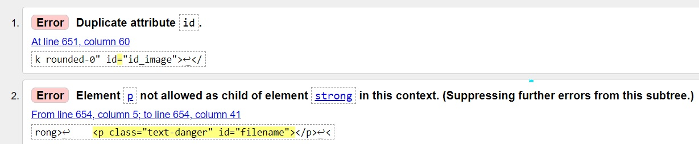

- On the 'Checkout' page also bug occurred while testing, I took away the 'for' attribute for the 'label' tag since it was not matching 'id' in this check form to save data and not passing validation. 

- Because of the time issue, I am kind of force to leave another issue as an unresolved bug, on the 'Shopping Bag' page, during the validation another error occurred. While loading data for desktop view and medium and small devices 'id' used to decrement and increment numerous items in the shopping bag was causing a problem after refactoring a whole page. On a large screen did not work as expected allowing a user to make a value under 1 which could cause a problem when updating shopping bag items, a user could accidentally remove all of the items from the bag scrolling value til  -1. Since this feature is picked from HTML as a first on mobile view it was not working for large devices, so that is why I have decided to remove that possibility for mobile users to pass validation at this point. While loading data users can see the summary and proceed directly to the checkout without adjusting the bag,  this will be implemented as a future feature. 

- Another issue refers to testing manually webhook handler for Stripe payment methods, all functionality works as expected for this application, triggering a button is creating order and charge and payment intent is returned as succeded, however, I received in terminal error by sending webhook handler test which was bringing error 500, and I found that similar issue was mentioned also by other students and leaders on Slack and it was a common issue that cache_checkout_data is what populates metadata with "bag" and "save info" - [**link**](https://code-institute-room.slack.com/archives/C7HS3U3AP/p1631980362410300)

# 7. Version Control

**Git** - free and open-source distributed **Version Control System** was used to show tracking all changes during the coding process. Commands used to approve and store files in the repository: 
- `Git add .`  - adds files/directories to the staging area to be committed
- `Git commit -m " "` - commits files/directories to the repository with specific message
- `Git push` - pushes all committed inserts into the GitHub repository
 

# 8. Deployment

This project was edited and developed using the IDE GitPod and version control software Git to add, commit and push the code to GitHub where it was stored. This project uses recommended for students Code Institute template with the automatically included main branch.

> Deployment steps to the Heroku hosting page consist of:

- create a new repository in GitHub named 'Easy_Skincare' by using a mentioned template
- open the repository in GitPod-VSC by cloning the repo from GitHub
- develop a fundamental part of the project to the stage when is ready for deployment to the hosting platform
- log in to Heroku page and click "New' and then select 'Create New App'
- give an app a unique name, using dashes instead of spaces, like entering 'easy-skincare' in the input field 'App name'  
- select the region free to use and closest to my location 'Europe' and click 'Create App'
- head to 'Resources' tab and type in Postgres in the Add-ons search bar
- select Heroku Postgres and provision a Hobby Dev-Free database
- back to GitPod and install by typing `pip3 install dj_database_url` and `pip3 install psycopg2-binary`
- freeze requirements to the txt file by typing `pip3 freeze > requirements.txt` in the terminal which informs Heroku what dependencies are required
- store database setup by `import dj_database_url` in settings.py
- retrieve the Database URL from the hidden Config Vars in Heroku
- paste the Database URL in the database path in settings.py and remove the local settings
- to save that in terminal, run migrations to build the database in Postgres by typing `python3 manage.py migrate`
- to import data load JSON files for Categories and Products by typing `python3 manage.py loaddata categories` and `python3 manage.py loaddata products`, in that specific order
- create a superuser by typing `python3 manage.py createsuperuser` and follow the instructions shown in the terminal
- remove the Postgres Database URL from settings.py so it will not end up in version control, and commit changes
- install sort of webserver by typing `pip3 install gunicorn` and freeze that to the requirements.txt file
- create a Procfile and type `web: gunicorn easy-skincare.wsgi:application` to the file, make sure there is no extra line after the first line as this can confuse host Heroku
- log in to Heroku by typing `heroku login -i`
- type `heroku config:set DISABLE_COLLECTSTATIC=1` (in my case also in the end add `--app easy-skincare`) in the terminal to stop Heroku from collecting the static files
- allow Host in settings.py by inserting heroku app name and localhost
- add, commit and push all changes to GitHub
- type `git push heroku main` to push everything to Heroku and check if the app was deployed successfully (pray at that moment)
- set to automatic deploy in Heroku, select 'Deploy' tab from the Heroku App menu and select 'GitHub' from the 'Deployment method' section of the page
- ensure that GitHub profile name was showing properly and search for repo name in the input 'Search' field
- once the repo is found, click 'Connect' to complete that action and 'Enable Automatic Deploys' every time code is pushed to GitHub it will end up in Heroku as well
- set up a secret key, select 'Settings' from the Heroku App menu, select 'Reveal Config Vars' and insert the relevant key/value information
- back to the settings.py and replace the secret key with the call to get it from the environment `SECRET_KEY = os.environ.get("SECRET_KEY", "")`
- make sure that during development proccess all necessary settings (key and value) for config variables are included:
    - `AWS_ACCESS_KEY_ID =	<value here>`
    - `AWS_SECRET_ACCESS_KEY =	<value here>`
    - `DATABASE_URL =	<value here>`
    - `DISABLE_COLLECTSTATIC =	1 <will be removed later on>` 
    - `EMAIL_HOST_PASS = <value here>`
    - `EMAIL_HOST_USER = <value here>`
    - `SECRET_KEY = <value here>`
    - `STRIPE_PUBLIC_KEY = <value here>`
    - `STRIPE_SECRET_KEY = <value here>`
    - `STRIPE_WH_SECRET = <value here>`
    - `USE_AWS = True`

> Deployment steps to the Amazon Web Services cloud-base storage consist of:

- create an Amazon AWS account, please take into consideration that authorization can take some days according to current standard procedures 
- once your account exist and you are logged in, go to AWS Management Console and search for **S3 - Simple Storage Service**, and then create a new bucket, select the region, allow public access to the files, and approve
- under the 'Properties' tab turn on 'Static website hosting', then enable host website and add index.html and error.html, and save
- under the 'Permissions' tab paste CORS configuration, like so:
```
[
  {
      "AllowedHeaders": [
          "Authorization"
      ],
      "AllowedMethods": [
          "GET"
      ],
      "AllowedOrigins": [
          "*"
      ],
      "ExposeHeaders": []
  }
]
```
- under the 'Permissions' tab go to 'Bucket Policy' and select 'Policy generator' to create security for this bucket, chose 'S3 Bucket Policy' as Select Type of Policy, enter '*' for Principal, select Actions as 'GetObject', Enter 'ARN' created earlier in 'Bucket Policy'
approve by 'Add Statement' and then 'Generate Policy'
- copy whole Policy JSON file and paste it into the 'Bucket Policy', add '/*' at the end of Resources line and save changes
- under the 'Access Control List' tab set the 'List objects' permission for 'Everyone' and save


- with S3 Bucket ready create a user to access it, go back to AWS Management Console and search for **IAM - Identity and Access Management**
- from the IAM dashboard select 'User Groups', then create a new group by giving it a name, continue to click through and finally 'Create Group'
select 'Policies' and then create a policy
- under JSON tab click 'Import managed policy' and from a list provided choose AmazonS3FullAccess
- edit the resource with 'Bucket ARN' created earlier when making 'Bucket Policy' and paste that in this JSON file 
- click next step and go to 'Review policy', give the policy a name and description of your choice, and approve by 'Create policy'
- come back to User Groups and choose the group created earlier
- under the 'Permissions' click 'Add permissions', search for a created policy, and choose 'Attach Policy'
- finally under the 'Users' page click 'Add user', give it a user name, select 'Programmatic access' as the Access type and click 'Next Permissions'
- add the user to the Group just created by clicking 'Next' and 'Create User'
- download and save the .csv file containing the access key and secret access key for authentication, mark that this one is available once and can not be downland later on

> Connecting Django to AWS S3 consist of:

- to achieve that in terminal install boto3 and django-storages by typing `pip3 install boto3` and `pip3 install django-storages`
- next freeze those to the requirements file by typing `pip3 freeze > requirements.txt` so they can install and add 'storages' to installed apps 
- add an if statement in your settings.py to give a message for a place of storing those sensitive pieces of information  
- add the values from the .csv file to Heroku 'Config Vars' under Settings and remove the DISABLE_COLLECTSTATIC variable from a selection of variables
- create a custom_storages.py file and import django settings from django conf, and s3boto3 storages, add static storage class and media storage class, finally add information about those location settings in setting.py, add changes, commit them and push to trigger an automatic deployment to Heroku, check the Build Log if all of the files was build successfully 
- with S3 bucket set up, under the automatically created static folder, create a new folder called media and inside upload by clicking 'Add Files' all media files to it from the folder collection with product images, and other images used through the site
- then click 'Next' and under 'Manage public permissions' select 'Grant public read access' to make sure that all static and media files are publically accessible and click 'Upload'

> Local hosting by creating a clone consist of:

- navigate to my GitHub repo
- click the Code button next to the Green Gitpod button 
- choose either to download the zip file or clone the repo using GH https://github.com/MaggieDaisy/Easy_Skincare.git repo clone in the terminal 
- install the modules listed in the requirements.txt file by typing `python3 -m pip -r requirements.txt` in the terminal
- install the JSON files using `python3 manage.py loaddata categories`, and `python3 manage.py loaddata products`, in this order
- create a SuperUser by using `python3 manage.py createsuperuser` and follow further instructions
- run migrations to create a database by using `python3 manage.py migrate`
- create an env.py file in your application folder and add the following:
```
import os
os.environ.setdefault("SECRET_KEY", "value here")
os.environ.setdefault("STRIPE_PUBLIC_KEY","value here",)
os.environ.setdefault("STRIPE_SECRET_KEY","value here",)
os.environ.setdefault("STRIPE_WH_SECRET", "value here")
os.environ.setdefault("EMAIL_HOST_PASS", "value here")
os.environ.setdefault("EMAIL_HOST_USER", "value here")
````
- the app can now be run locally by typing `python3 manage.py runserver` in the terminal


# 9. Credits

> Content

The text content for this page was created by student Malgorzata Czerwonka (self-written) for a **non-existing company**, and for **educational purposes only**. Inspiration to create informative and consistent content through different parts of application was self-interest in a beauty field and following after world-class specialists from skincare and world-class trusted companies.
 
- [**CeraVe**](https://www.cerave.com/)
- [**The Ordinary**](https://deciem.com/en-us/theordinary)
- [**The Inkey List**](https://www.theinkeylist.com/)
- [**Naturium**](https://naturium.com/)
- [**Paula's Choice**](https://www.paulaschoice.com/)
- [**Neutrogena**](https://www.neutrogena.com/)
- [**Colorscience**](https://www.colorescience.com/)
- [**COSRX**](https://www.cosrx.com/)

> Media

All the images used in this site to provide product visuality were picked from producers and product providers like those listed above. The rest pictures used for design were picked.

- [**Flaticon**](https://www.flaticon.com/) - free vector icons and stickers for dev projects, resources made by and for designers

- [**Unsplash**](https://unsplash.com/) - a website dedicated to sharing stock photography for free for every kind of project

> Code
- Code inspiration for the whole project and code snippets for the fundamental base structure borrowed from Walkthrough Project created by CI - [**Boutique Ado**](https://mag-boutique-ado.herokuapp.com/)
- Code inspiration for Review model borrowed and adapted from tutorial - [**Product reviews - How to build an Ecommerce website using Django**](https://www.youtube.com/watch?v=Y5vvGQyHtpM)
- Code inspiration for Wishlist model borrowed and adpated, after second learning session, from my mentor Sandeep Aggarwal


# 10. Acknowledgments

- Inspiration for this project was the walkthrough full e-commerce project "Boutique Ado" created by CI
- I would like to thank: 
    - Code Institute tutors for creating inspiring content for the course and support during learning process,
    - Slack Community, students and leaders, for being available and very helpful every single time when needed,
    - and last but not least my mentor Sandeep Aggarwal for his guidance, patience, and effort during the development process


