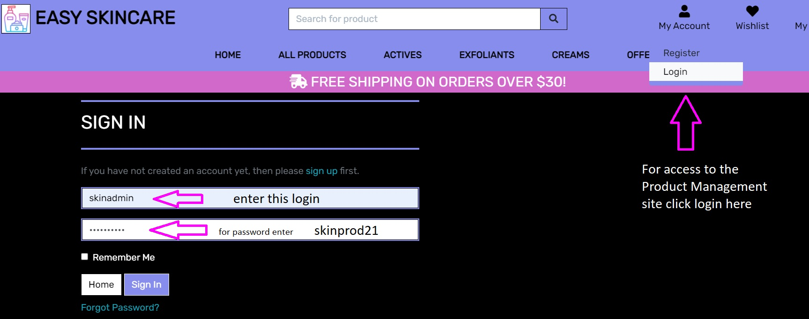

# Manual testing on features

The first step of the testing process was to create a repository with the basic framework of this application, install all necessary tools and settings for Django, and check if the attached links for navigation between pages and buttons and other planned features work properly. Then the application was developed successively step by step, page by page, model after model, and finally deployed to the hosting platform. During the development process, all the features were checked after they were included, mostly by the running server and displaying the part that was created, and checking if a correct message appears in the terminal, like GET and 200 response. Last proper manual testing included one more detailed checking if everything works as expected after project deployment.

1. **Brand name link with logo icon link** - has been checked and confirmed that directs the user successfully to the Home page.
2. **All links settled in the top navigation bar** - have been checked that allows the user to navigate between individual pages like Home, All Products, Actives, Exfoliants, Creams, Offers, My Account, Wishlist, My Bag.
3. **Category dropdowns selection for products at navigation bar** - has been checked that display properly product category name, and all elements are clickable giving a user option to browse to the separate pages
4. **All links settled in the side navigation bar for small and medium devices** - also have been checked that allows the user to navigate between individual pages.

5. **Button 'Shop Here' nested at the Home Page** - has been checked and ensured that directs the user short a way from content to 'All Products' available page.

6. **Card selection at the Home Page** - has been checked that scrolls properly and gives a user visual experience together with the experience of interaction. During navigation, users can see the theme of the page and move to detail about the E-consultation offer by using an included button on the bottom of the page.

7. **Search bar located at every page as a part of navigation bar** - has been checked and ensured that returns results of searching in the database for key words possible to find in name and description of products.

8. **Card Panels at Different Products Pages** - has been checked and ensured that returns all planned content for separate products, like a picture, name, price, category, and rating, picture acts as a link to bring a user to the Product Detail page
9. **Product Detail Page** - has been checked and ensured that returns product name, price, category, rating, add to wishlist button, product description, quantity option, buttons for add product to the bag and continue shopping, as well as possibilty to give a comment review to this specific product
10. **Shopping Bag Page** - has been checked and ensured that returns
11. **Checkout Page** - has been checked and ensured that returns
12. **Checkout Success Page** - has been checked and ensured that returns
13. **Product Management Page available for registered users** - has been checked and ensured that gives the site/store owners possibility for simple manipulation of database by adding, editing, updating and deleting products.
14. **Profile Page available for registered users** - has been checked and ensured that returns order history and prefilled delivery details
15. **Add Review available for registered users** - has been checked and ensured that displays added review under the specific product at Product Detail Page
16. **Wishlist Page available for registered users** - has been checked and ensured that displays all products added to the wishlist from Product Detail Page
17. **Login Page** - has been checked and ensured that after inserting required data brings a user to the profile page.
18. **Register Page** - has been checked and ensured that after inserting required data brings a user to the profile page.
19. **Logout** - has been checked and ensured that after clicking on the link takes out a user from the profile page.
20. **Social media icons settled in the footer** - has been checked and ensured that points the user to social media main pages and opens in a new tab.

# Validation of code
When the site developed closer to the final stage, the next test was to check eventually errors in a code validation.
- **HTML** - passing rendered code into The W3C Markup Validation Service brought some warnings about javascript type, this warning does not cause any problems for the application. 

- **CSS** - passing code into The W3C CSS Validation Service - Jigsaw brought no errors.

- **Java Script** - passing code to JSHint a static code analysis tool for JavaScript returned some ,,,,,,,,,,,,????????? despite this, the functionality of code worked for the application.

- **PEP8** - check code for PEP8 requirements, passing code into PEP8 online returned no errors, however in the terminal still visible some problems about imports that are imported but not used, lines too long, pylinth ,,,,,,,,?????? etc 

# Other tests on browsers and devices
- **Google Chrome Developer Tools** - The further tests of the application were about to check responsiveness in all pages using devtools. Multiple tests on multiple desktop sizes confirmed that a structure works quite well on mobile devices as well as bigger desktop sizes. The tests were conducted mainly with the use of the Google Chrome browser. However, the research also covered other browsers such as Mozilla Firefox, Microsoft Edge, and Apple Safari. In general, after inspecting by use of the tools available in each browser, it was found that the application displays correctly and is responsive to different screen sizes. 

| Browser | Device | Compatibility |
| --- | --- | --- |
| Google Chrome | HP Spectre 13 | no problems occurred |
| Mozilla Firefox | HP Spectre 13 | no problems occurred |
| Microsoft Edge | HP Spectre 13 | no problems occurred |
| Google Chrome | Asus TUF | no problems occurred |
| Mozilla Firefox | Asus TUF | no problems occurred |
| Microsoft Edge | Asus TUF | no problems occurred |
| Apple Safari | iMac | no problems occurred |
| Apple Safari | iPad 5th gen | no problems occurred |

- In addition, the test was performed live on devices such as Huawei P20, Samsung Galaxy S10, iPhone 11, iPad 9.7, HP Spectre 13, Asus TUF, iMac. The result was very good and shown that on all those screen devices website was responsive and displayed as expected.

- **Lighthouse web.dev** - Further tests were done by using Lighthouse open source, the performance result was good, no common issues were shown about timing, interactions, accesibility.

- **Google Mobile-Friendly Test Tool** - Continuing subsequent tests included a test on mobile devices such as mobile phones, the entire application was checked with Google Mobile-Friendly Test Tool and showed that the design is friendly to such devices.

- **Grammarly** - Final tests were about to check grammar and spelling throughout the whole site content and Readme file and Test file, page by page text was run through Grammarly application and showed several errors to correct. 

# User stories 

> Answering to a user story needs: 

- Tests made on the top located navigation bar shown that every person visiting the site will be able to navigate very easily between sections to find pieces of information. Clickable links are bringing the user to different pages. The navigation bar with active links is available all the time on top of the page, so it is easy to switch and back to desirable content.
- Tests made on the separate pages shown that users will be able to learn about the application very fast. The 'Home' - landing page contains very intuitive information and shows the purpose of the website.
- Tests made on the 'Register' page shown that all process is very easy and quick and does not require a lot of data to have access to the full content of the application. Profile account can be created in 3 steps, by entering Username, Password, and click on submit button. 
- Test made on The 'Products' page which presents card panels with different products is very clear and meets the users expectation. Each card panel contains clickable image which acts as a link to further product detail page, a product name, price, category and rating. 
- Tests made on footers social media icons allows user to find visible and easy access to social media. Clickable links are giving the user possibility to observe and join the community for skincare lovers.
- Tests made on different screen sizes show that the application is responsive, so the user can look at the page on different devices.
- Tests made on the 'Login' page has shown that existing user has very simple access to the full content of the page.  Similar to registration, logging in takes only 3 steps, so makes access very smooth and fast. 
- Tests made on the 'Product Detail' page shown that users have a great possibility to read full description of the product, Add to Wishlist if needed, Add to Bag so it will trigger purchase and redirect user to the secure checkout, also Add Review to share opinion about this browsed product 
- Tests made on the 'Profile' page shown that users can easily see their own data for delivery and orders history stored in one place. 
- Tests made on the 'Logout' link confirm that the user can very quickly leave the profile site by clicking on the navbar link. 
    - *Please note that imagery examples that cover testing for regular user stories can be found in the manual and crud testing section, as well as through whole documentation presented in Readme and tests file, many features and their functionality repats simultaneously

# Regular users/shoppers of the site
- The **registration** process by entering simple data info like Userneme and Password required went very easy and smooth and returned a toast message about a successfully created **Profile** page. 

- Then I tested out the **search bar** provided, I entered one of the ingredients of a recipe I wanted to contain, it was the word strawberry which successfully returned cocktail called Strawberry Daiquiri. I made sure that I can see and read other users recipes, browse between them, and search for them by **entering cocktail names or ingredients**. 

# CRUD for Product Management - available only for owners/admins

- One of the important part of testing on this application was to ensure that registered and authorised administration user can **Create, Read, Update and Delete** products in the database. So to check that all functionality works as it was planned I created a following user account with higher access priviliges, please use these login credentials 
    - login: skinadmin 
        and 
    - password: skinprod21

- Once the profile exists and login procedure is properly made, user gets automatically full access to the database of the page and the possibility to create new product card. So next step was to check if **'Add a Product'** page works properly, I head over to fill the provided form by entering product Category, SKU, Name, Description, Price, Rating, and selecting and uploading image from local maschine

- After clicking on Add Product/Submit **button, the product was successfully added** to the collection and returned user to the 'Product Detail' page with all functionality for Edit and Delete, Add to Wishlist, Add to Bag and Add Review multitask page

- I made sure that the **card panel with a new product** appeared on the page with selected category for E-consultation (choice taken only for easy testing feature)

- Then I checked if the **card panel edit link works** after clicking on it I was returned to a **pre-filled form** with the product details already created. I changed one line in descritption field 

- After everything was looking good and changing some content I tested the **update button for a product**, this brought me to the Product Detail page and returned a toast message that my product was successfully updated. 

- Then I head to the Delete link and I checked if I can **delete my product**. I tested out link which returned an message that my product was deleted from the collection. I checked the page with cards for specific category to make sure that it was gone

- The last step was to check if the user can safely leave the page, I tested the log-out link provided in the navbar. After clicking on that I received a message that I have been **logged out** and other users do not have access to my creations. 

**The above tests confirm that the application fulfills its task and registered and logged-in user who will be administrative person for this store can read, create, edit and delete products easily via site** of course other functionality for updating database is provided via admin site in application, where user will have access to correct every action which will apper on this website.

# Debug mode

During the development process debug mode was turned as "True", after a production version of the application needs to be changed for the development version debug mode was turned as "False". 

