**You can very easily come back to Readme** ---> please click [**HERE**](README.md)

# Manual testing on features

The first step of the testing process was to create a repository with the basic framework of this application, install all necessary tools and settings for Django, and check if the attached links for navigation between pages and buttons and other planned features work properly. Then the application was developed successively step by step, page by page, model after model, and finally deployed to the hosting platform. During the development process, all the features were checked after they were included, mostly by the running server and displaying the part that was created, and checking if a correct message appears in the terminal, like GET/POST and 200 response. Last proper manual testing included one more detailed checking if everything works as expected after project deployment.

1. **Brand name link with logo icon link** - has been checked and confirmed that directs the user successfully to the 'Home' page on click.
2. **All links settled in the top navigation bar** - have been checked that allows the user to navigate between individual pages like Home, All Products, Actives, Exfoliants, Creams, Offers, My Account, Wishlist, My Bag.
3. **Category dropdowns selection for products and account at navigation bar** - has been checked that display properly product category name, and all elements are clickable giving a user option to browse to the separate pages. The 'Signing' in option, correctly shows the dropdown options, Profile, and Logout. The 'Signing out' also shows the correct dropdown options, Login, and Register. The Admins of the site, have an additional option in the dropdown menu to the 'Product Management' page. 
4. **All links settled in the side navigation bar for small and medium devices** - also have been checked that allows the user to navigate between individual pages and the whole bar is fully responsive on those resolutions, only on very small devices like 280px navigation links are not wrapping properly.
5. **Button 'Shop Here' nested at the Home Page** - has been checked and ensured that directs the user a short way from content to 'All Products' available page.
6. **Card selection at the Home Page** - has been checked that scrolls properly and gives a user visual experience together with the experience of interaction. During navigation, users can see the theme of the page, pieces of advice about skincare, and move to detail about the E-consultation offer by using an included button on the bottom of the page.
7. **Search bar located at every page as a part of navigation bar** - has been checked and ensured that returns results of searching in the database for key words possible to find in name and description of products. Visible included feedback about fiding items for specific input.
8. **Card panels at different Products pages** - has been checked and ensured that returns properly all planned content for separate products from the database, like a picture, product name, price, category, and rating. Picture acts as a link to bring a user to the specific 'Product Detail' page. Sorting functionality works as well by sorting products by price, category, name, rating - descending or ascending. Product has tags that are active and correctly redirecting and filtering products by category name.
9. **Product Detail Page** - has been checked and ensured that returns user to correct product and details stored in the database, like product name, image, price, category, rating, and full description. Page display 'Add to Wishlist' button and shows up this possibility only for logged in users. Product quantity option buttons are disabled from 1-99. The page displays 'Add Product' to the bag and 'Continue shopping' buttons, which works as expected, add to bag successfully place a product in the shopping bag and continue shopping redirects the user back to the 'All Products' page. Here also exist the 'Add Review' button that gives the possibility to leave a comment review to this specific product, button successfully returns the user to the form where a review can be written.
10. **Shopping Bag Page** - has been checked and ensured that returns correct products chosen by the user. The shopping 'My Bag' link on the top of the navbar shows the value of the current bag session. This page displays also quantity buttons that are working properly and preventing the user from exceeding 99 and going below 1. After adding all products to the bag totals are shown correctly and the free delivery threshold updates accordingly to the user action and returns current values. When firstly adding items to the bag, and then logging in after user can see how this retains the current bag.
11. **Checkout Page and Checkout Success Page** - 'Checkout' page has been checked and ensured that returns correct products with their prices and all core information are transferred properly from the 'Shopping bag' page. The whole form for delivery details and payment form for the card responding properly, payment field shows incorrect inputs if occurred. The 'Checkout' page smoothly redirects the user to the 'Checkout success' page and the Stripe payment system correctly shows 200 status webhooks for registered orders.
12. **Product Management Page available for registered users** - has been checked and ensured that gives the site/store owners possibility for simple manipulation of the database by adding, editing, updating, and deleting products. This link at the top navigation menu redirects the admin directly to the 'Add product' page with the build-in form to make that process super easy. Confirmed that only admins have access to the 'Product Management' page on the account dropdown and only they can see and have access to the features mentioned above, like add product, edit and delete products from the cards or product detail page. All functionality for this will be shown in the crud section in this file and proven that all features were checked and work properly. 
13. **Profile Page available for registered users** - has been checked and ensured that returns order history and prefilled delivery details for registered earlier users who made a purchase in the past. 
14. **Add Review available for registered users** - has been checked and ensured that displays added review under the specific product at 'Product Detail' page. The existing button points the user to the product review form which matches the name of the product from the database, and leaves space for comment content, this option can show only for users registered and logged in. The review will show automatically the date of adding it and the user name and will be deleted from the database once a user is not existing anymore. 
15. **Wishlist Page available for registered users** - has been checked and ensured that stores and displays all products added to the wishlist from the 'Product Detail' page. Only users who are logged in have the option to add a product to the wishlist, otherwise, they are redirected to the Login page first. The Wishlist page displays image, product name, price, and a possibility to add a review from this point as well. Products will be removed from the wishlist automatically once removing user profile from the database. 
16. **Login Page** - has been checked and ensured that after inserting required data brings a user to the profile page.
17. **Register Page** - has been checked and ensured that after inserting required data brings a user to the profile page.
18. **Logout** - has been checked and ensured that after clicking on the link takes out a user from the profile page.
19. **Social media icons settled in the footer** - has been checked and ensured that points the user to social media main pages and opens in a new tab. 

# Validation of code
When the site developed closer to the final stage, the next test was to check eventually errors in a code validation.
- **HTML** - passing rendered code into The W3C Markup Validation Service brought some warnings about javascript type, this warning does not cause any problems for the application. 

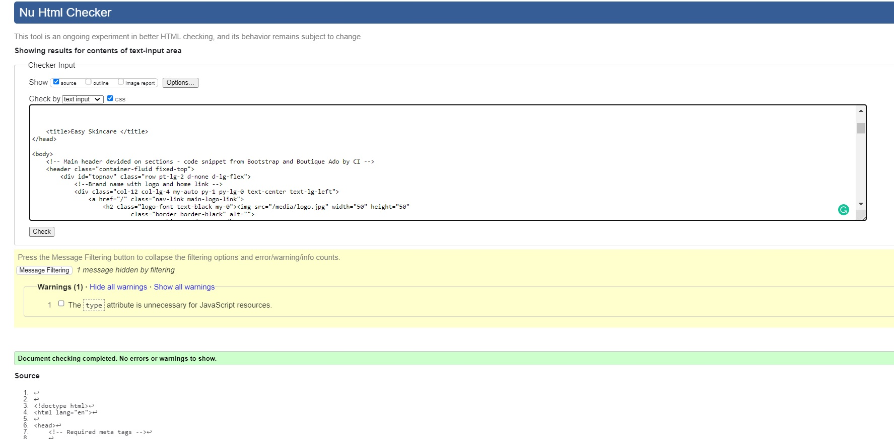

- **CSS** - passing code into The W3C CSS Validation Service - Jigsaw brought no errors, static files that have been under validation - base.css, profile.css, checkout.css, none causing any issues

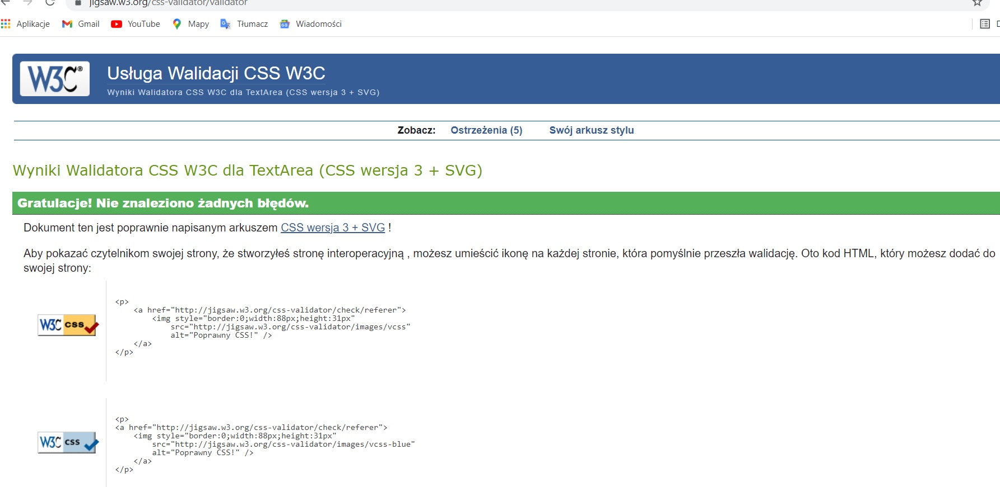

- **Java Script** - passing code to JSHint a static code analysis tool for JavaScript returned some information, no errors have been found, but only some metrics, warnings and undefine variables, despite these small details the functionality of code worked for the application, files that have been tested - stripe_elements.js, countryfield.js, and some small pieces of code included at the bottom in various html templates

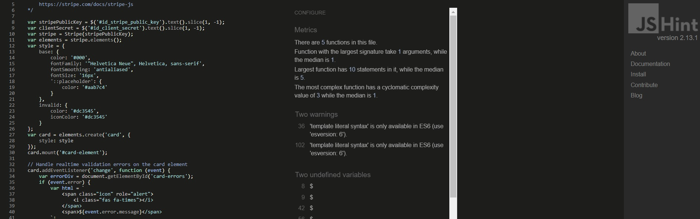

- **JSON files** - passing code to the JSON Formatter and Validator brought no errors, two core files were tested for buildup database: products.json, categories.json

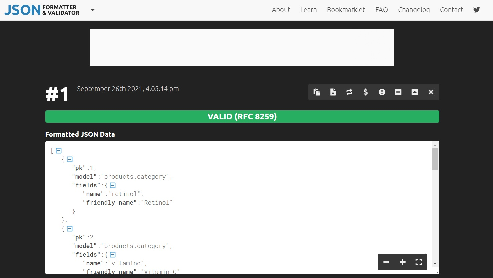

- **Python + Django code and PEP8** - For a clean and more easy development process python extension was installed and used to test and correct Python code on regular basis for Pep8 compliance with its built-in linting too. That tool was very handy especially when it comes to so complex structure of code. To check all errors, collected on one place, that possibly occured during developmnt I runned in terminal command 
`python3 -m flake8`
> Many of the Python errors were fixed during development immediately when appeared, there were kind of hard to document them all in one short file. 
- Some examples:
`./bag/admin.p F401 'django.contrib.admin' imported but unused`
`./bag/models.py:1:1: F401 'django.db.models' imported but unused`
`./bag/tests.py:1:1: F401 'django.test.TestCase' imported but unused`

> Those errors which are related to files that were auto-generated by Django were left untouched, and I mean by that mostly:
- migration files which are coming automatically, fx:
`./products/migrations/0001_initial.py:20:80: E501 line too long (91 > 79 characters)`
- project settings.py
`./easy_skincare/settings.py:147:80: E501 line too long (81 > 79 characters)`
- errors referring to the variable (e) not being used, can not be deleted or fix by any action because (e) as a variable is used to capture errors from the Stripe payment webhook handler
`./checkout/webhooks.py:25:5: F841 local variable 'e' is assigned to but never used`
- checkout signals error saying that are imported but unused, it this case import is used to let Django know there is a signals module, listening for changes to automatically updating the totals in bag
`./checkout/apps.py:9:9: F401 'checkout.signals' imported but unused`
- other errors referring to the lines being too long because sometimes it is just impossible to fix some errors without breaking the code itself, like fx:
`./checkout/webhook_handler.py:101:80: E501 line too long (107 > 79 characters)`
errors that are just showing too many characters or simply not the best application of a string, like fx:
`./profiles/models.py:28:24: DJ01 Avoid using null=True on string-based fields such CharField.`
`./profiles/models.py:29:80: E501 line too long (80 > 79 characters)`

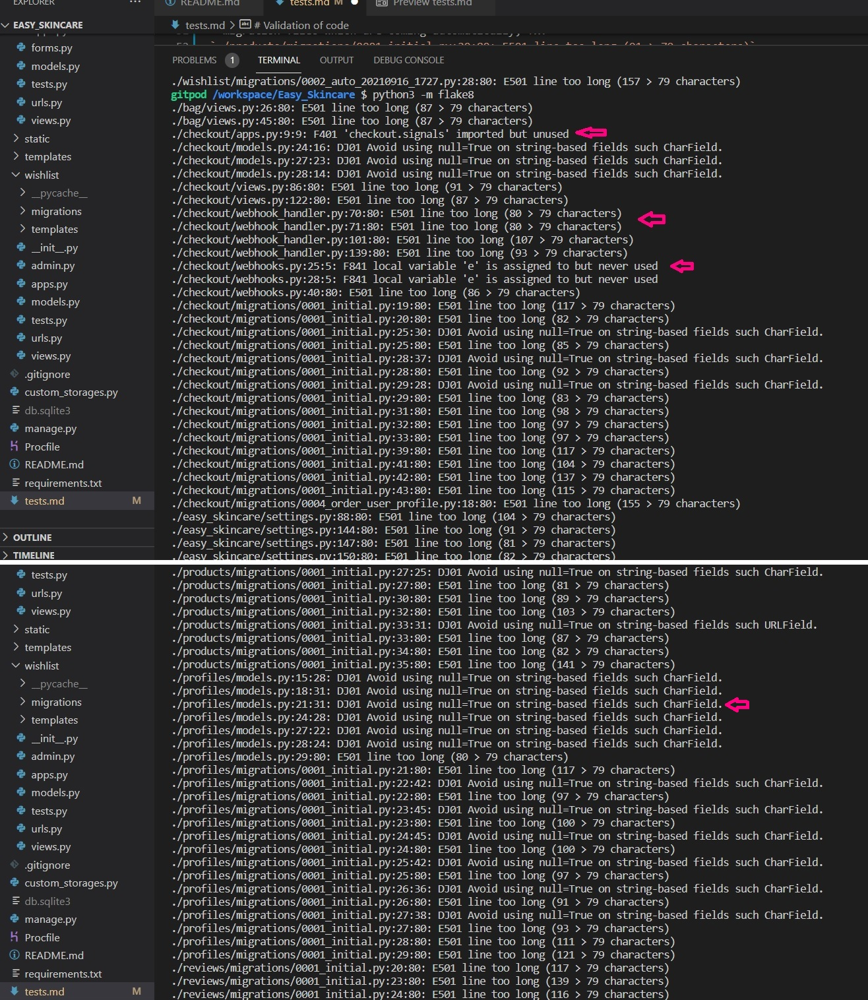

# Other tests on browsers and devices
- **Google Chrome Developer Tools** - The further tests of the application were about to check responsiveness in all pages using devtools. Multiple tests on multiple desktop sizes confirmed that a structure works quite well on mobile devices as well as bigger desktop sizes. The tests were conducted mainly with the use of the Google Chrome browser. However, the research also covered other browsers such as Mozilla Firefox, Microsoft Edge, and Apple Safari. In general, after inspecting by use of the tools available in each browser, it was found that the application displays correctly and is responsive to different screen sizes. 

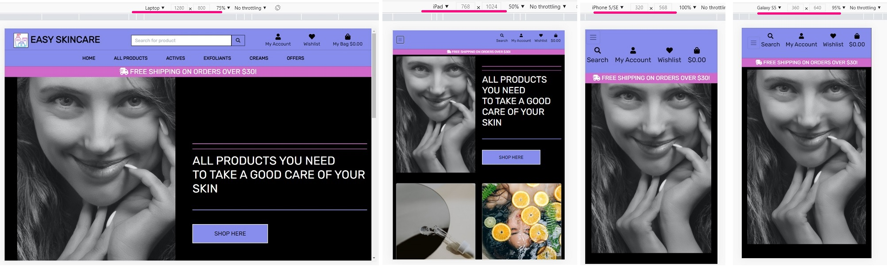

| Browser | Device | Compatibility |
| --- | --- | --- |
| Google Chrome | HP Spectre 13 | no problems occurred |
| Mozilla Firefox | HP Spectre 13 | no problems occurred |
| Microsoft Edge | HP Spectre 13 | no problems occurred |
| Google Chrome | Asus TUF | no problems occurred |
| Mozilla Firefox | Asus TUF | no problems occurred |
| Microsoft Edge | Asus TUF | no problems occurred |
| Apple Safari | iMac | no problems occurred |
| Apple Safari | iPad 5th gen | no problems occurred |

- In addition, the test was performed live on devices such as Huawei P20, Samsung Galaxy S10, iPhone 11, iPad 9.7, HP Spectre 13, Asus TUF, iMac. The result was very good and shown that on all those screen devices website was responsive and displayed as expected.

- **Lighthouse web.dev** - Further tests were done by using Lighthouse open source, the performance result was good, no common issues were shown about timing, interactions, accesibility.

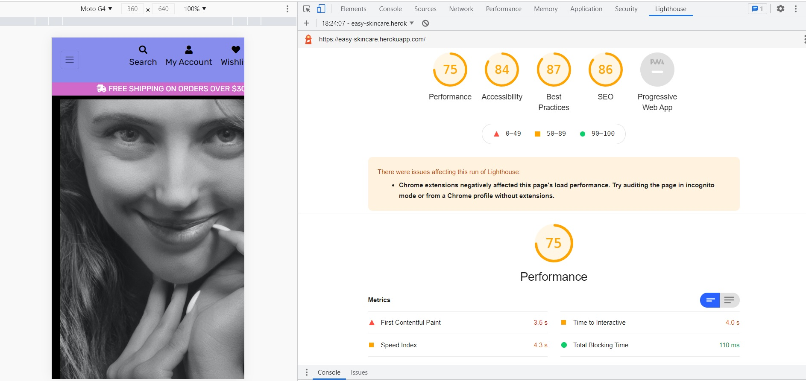

- **Google Mobile-Friendly Test Tool** - Continuing subsequent tests included a test on mobile devices such as mobile phones, the entire application was checked with Google Mobile-Friendly Test Tool and showed that the design is friendly to such devices.

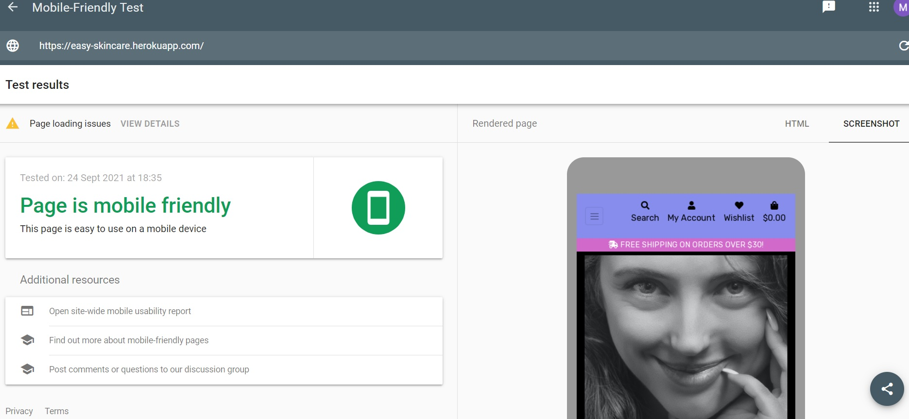

- **Grammarly** - Final tests were about to check grammar and spelling throughout the whole site content and Readme file and Test file, page by page text was run through Grammarly application and showed several errors to correct. 

# All User Stories 

> Answering to a user story needs: 

*Please note at this point that imagery examples that cover testing for regular user stories and for actual shoppers can be found below, as well as through whole documentation presented in Readme and tests file, some features and their functionality repats simultaneously. (Navigation bar, Search bar, Footer, Home Page, Products Page, Register/Login/Logout forms are already presented in Feature section and responsive tests in manual tests)

> ----- **Regular Site Browsing Users** -----

- Tests made on the top located navigation bar shown that every person visiting the site will be able to navigate very easily between sections to find pieces of information. Clickable links are bringing the user to different pages. The navigation bar with active links is available all the time on top of the page, so it is easy to switch and back to desirable content.
- Tests made on the separate pages shown that users will be able to learn about the application very fast. The 'Home'/ 'About' - landing page contains very intuitive information and shows the purpose of the website. Included 'Shop Here' button directs users to all products and services available to buy in this store.

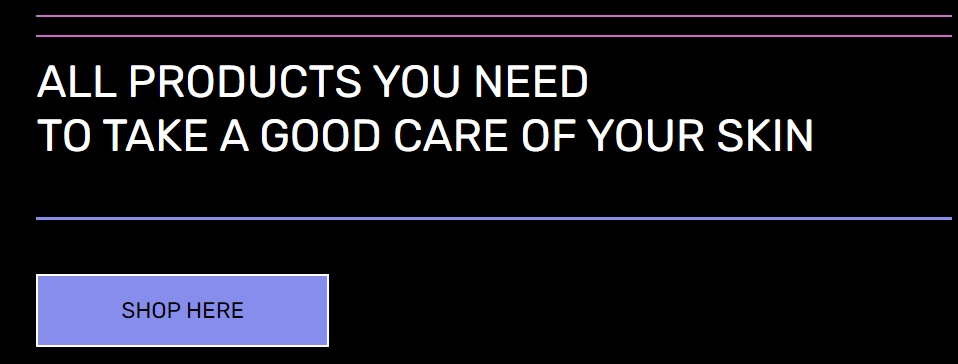

- Tests made on footers social media icons allows user to find visible and easy access to social media. Clickable links are giving the user possibility to observe and join the community for skincare lovers.
- Tests made on different screen sizes show that the application is responsive, so the user can look at the page on different devices.
- Tests made on the 'Register' page shown that all process is very easy and quick and does not require a lot of data to have access to the full content of the application. Profile account can be created in 3 steps, by entering Email, Username, Password, and click on submit button, confirming the email address, and signing in. To check that I created an account going through the **registration** process by entering simple data info like Email, Username and Password required, this went very easy and smooth and returned a toast message about a successfully created **Profile** page. 

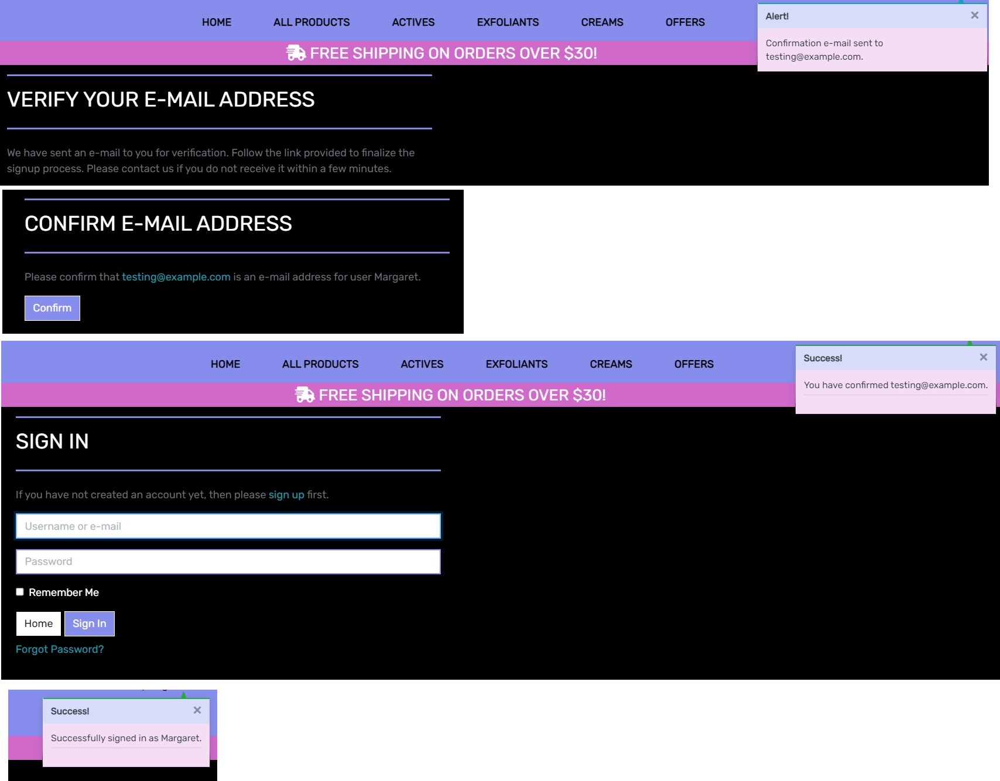

- Tests made on the 'Login' page has shown that existing user has very simple access to the full content of the page.  Similar to registration, logging in takes only 3 steps, so makes access very smooth and fast.

- Tests made on the 'Profile' page shown that users can easily see and update their own data for delivery, and check history of orders stored in one place. 

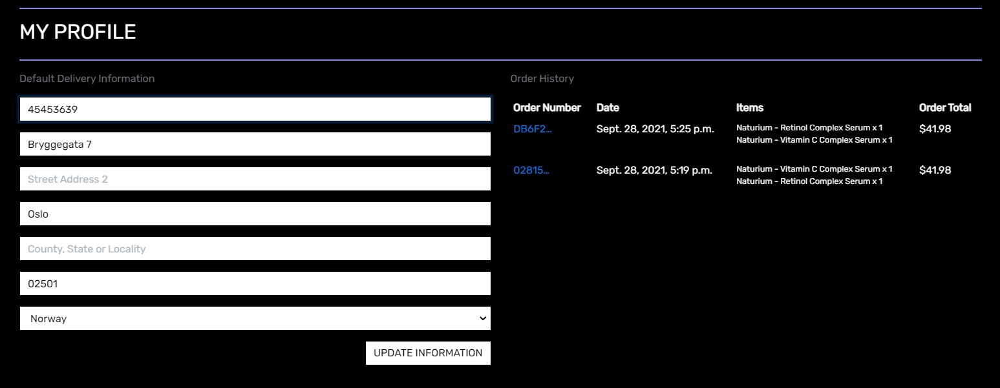

- Tests made on the 'Logout' link confirm that the user can very quickly leave the profile site by clicking on the navbar link.

- Test made on The 'Products' page which presents card panels with different products is very clear and meets the users' expectations. Each card panel contains a clickable image that acts as a link to a further product detail page, a product name, price, category, and rating.

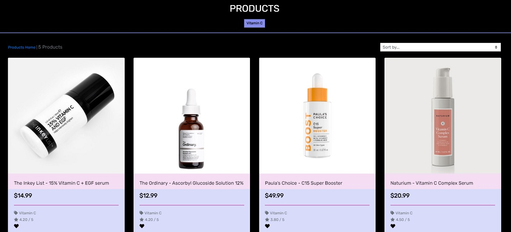

> ----- **Customer/Shoppers Users that are authenticated with all CRUD functionality** -----

- Users have the possibility to Create, Read, Update, Delete data at this website by:
    - create a user profile
    - update delivery information at user profile
    - create a shopping bag by adding products to it
    - update quantity of products in shopping bag
    - remove products from shopping bag
    - read all content, by browsing through the site
    - create and add review
    - create a wishlist

In that stage, tests that are made on the application show that the core part of the functionality is provided for every user of this application both regular users and shoppers can see the main pages and browse through the site so they are able to view a list of products and can select items to purchase. They can also view individual product details so that they can identify the price, description, product rating, product image, and have a possibility to add it to the wishlist, and read a review. They can quickly identify special offers, and available kits and consultations, so that they can take and advantage of them. They can easily view the total of purchases at any time and have control over spending money. Users are able to sort the list of available products and identify the best rated, best priced, and categorically sorted products. They can also sort a specific category of products so that they can find the best-priced or best-rated product in a specific category, or sort the product in that category by name. Finally, they can sort multiple categories of products simultaneously, so that they can find the best-priced or best-rated products across broad categories. Users can use the search bar to search for a product by name, category, or description keywords, they can see search results and decide if they found a product of their choice. 

- Tests made on the 'Product Detail' as a multitasking page shown that users have a great possibility to read the full description of the product, Add to Wishlist if needed, Add to Bag so it will trigger a purchase and redirect the user to the secure checkout, also Add Review to share an opinion about this browsed product. Shoppers are able to easily select the quantity of a product and make sure that they will not accidentally select the wrong product numbers of items.

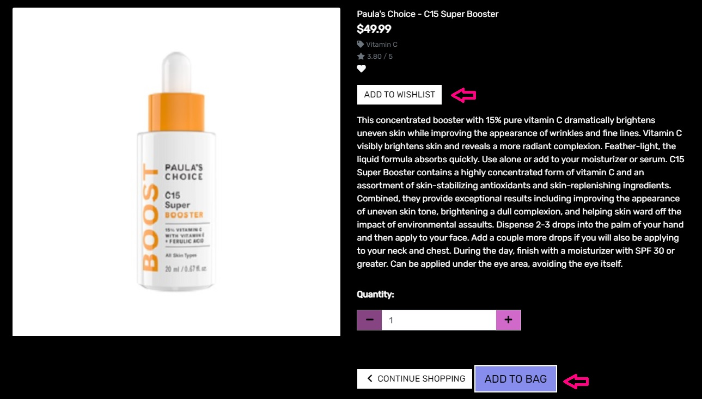

- Tests made on the 'Shopping Bag' Page returned the view of items to be purchased so that shoppers can identify the total cost of all items and they will receive this core information before moving to the final checkout. Shoppers can adjust the number of individual items in a bag, so they can easily make changes to the purchase before checkout.

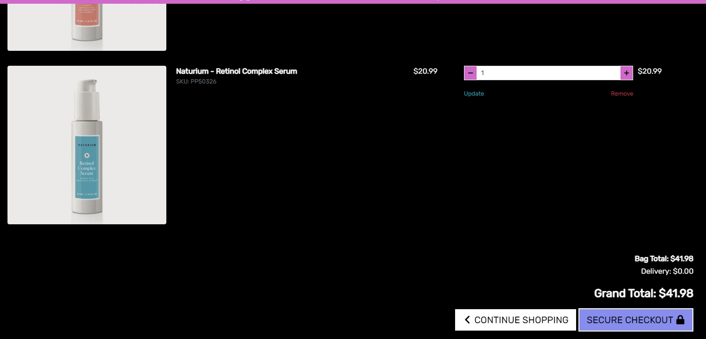

- For tests Stripe Payment Method used those recomended examples

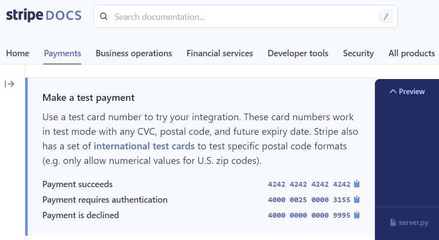

- Tests made on the 'Checkout' page shown that shoppers are able to enter payment information easily and go through the check-out procedure very quickly and with no hassles. Shoppers  can feel that personal data and payment information is safe, and secure so they can confidently provide the needed information to make a purchase.

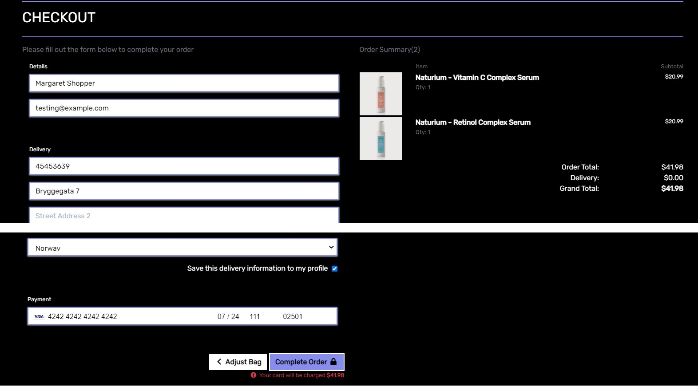

Tests made on the 'Checkout Success' page display an order confirmation after checkout so that shoppers can verify that purchase went well without making mistakes in the order. At that point, shoppers can receive an email confirmation after checking out and keep the confirmation of the purchase for the future records.

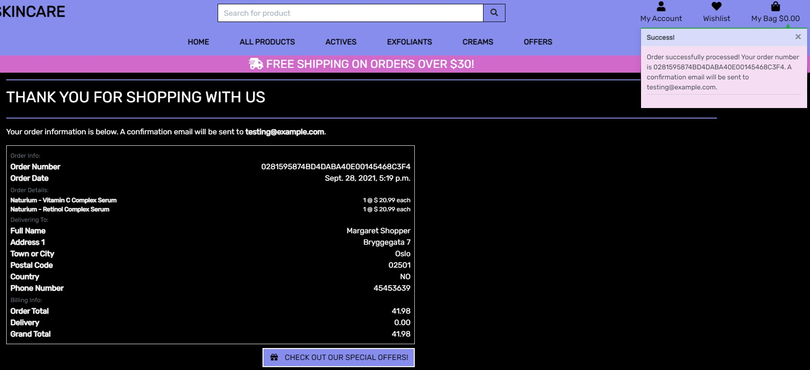

- Tests also included checking if the Stripe webhook handler works properly and return the result as expected, payment was succeded. 

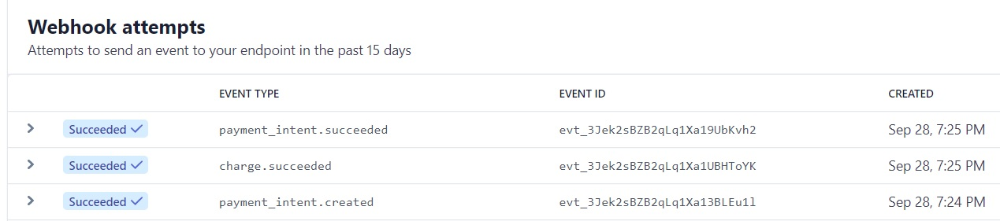

- A confirmation email for an order has been sent to the email address provided by the user. 

- An order has been created and stored in the database, together with all data provided by a user. 

- Tests made on a 'Wishlist' page shown that logged users can create a list with favorite products and store it for the future, here user can add a review to this specific product as well, if want to.

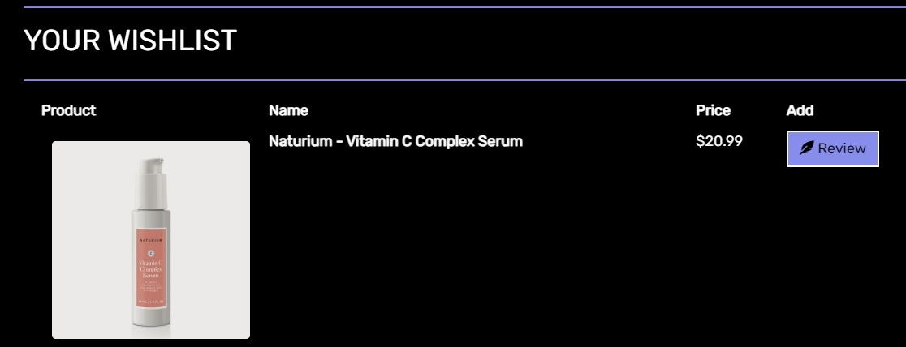

- Tests made on a review shown that logged in users can create a review by using a form that contains the name of the product and field for inserting content, and by clicking submit button user can add a review to this specific product which will be created with the actual date and user name 

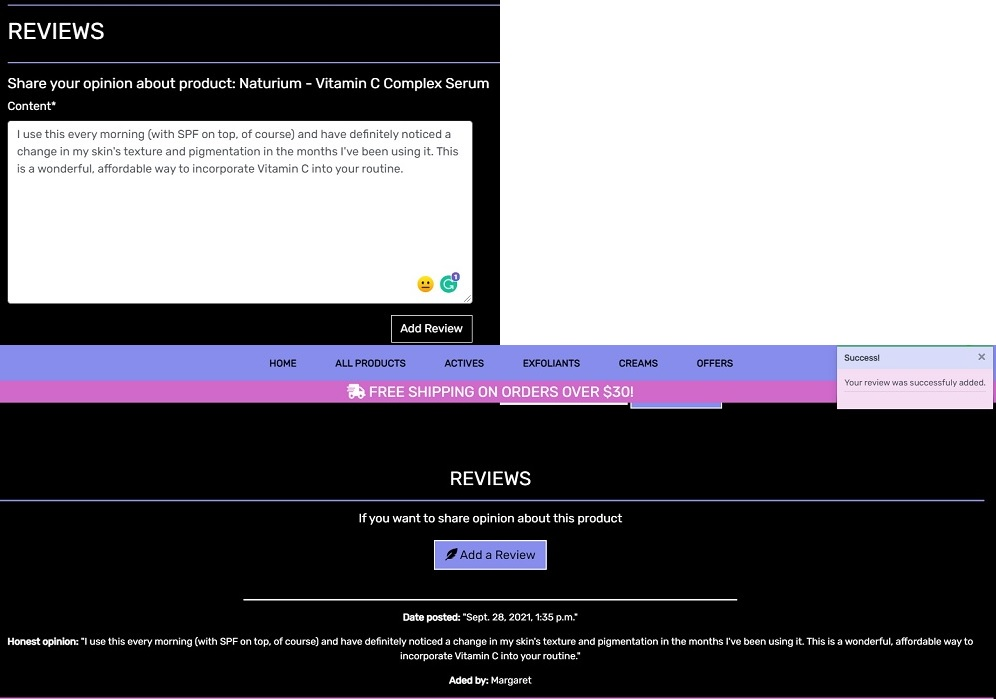

> ----- **Product Management - available only for authorized Site Owners/Admins with CRUD functionality** -----

- One of the important parts of testing on this application was to ensure that registered and authorized administration user can **Create, Read, Update and Delete** products in the database. So to check that all functionality works as it was planned I created the following user account with higher access privileges, please use these login credentials 
    - login: skinadmin 
    - password: skinprod21

- Once the profile exists and the login procedure is properly made, a user gets automatically full access to the database of the page and the possibility to create a new product card. So next step was to check if **'Add a Product'** page works properly, I head over to fill the provided form by entering product Category, SKU, Name, Description, Price, Rating, and selecting and uploading an image from local machine.

-  After clicking on Add Product/Submit **button, the product was successfully added** to the collection and returned the user to the 'Product Detail' page with all functionality for Edit and Delete, Add to Wishlist, Add to Bag and Add Review multitask page.

- I made sure that the **card panel with a new product** appeared on the page with selected category for E-consultation (choice taken only for easy testing feature).

- Then I checked if the **card panel edit link works** after clicking on it I was returned to a **pre-filled form** with the product details already created. I changed one line in the description field.

- After everything was looking good and changing some content I tested the **update button for a product**, this brought me to the Product Detail page and returned a toast message that my product was successfully updated. 

- Then I head to the Delete link and I checked if I can **delete my product**. I tested out the link which returned an **alert asking** if I am sure about the deletion of this product. I clicked delete and I received a message that my product was deleted from the collection. I checked the page with cards for a specific category to make sure that it was gone from there.

- The last step was to check if the user can safely leave the page, I tested the log-out link provided in the navbar. After clicking on that I received a message that I have been **logged out** and other users do not have access to my creations. 

**The above tests confirm that the application fulfills its task and a registered and logged-in user who will be an administrative person for this store can read, create, edit and delete products easily via site** of course, another functionality for updating the database is provided via admin site in application, where the user will have access to correct every action which will appear on this website.

# Debug mode

During the development process debug mode was turned as "True", after a production version of the application needs to be changed for the development version debug mode was turned as "False". 

Pages created for handling 404 and 500 errors keep the user on the site when something is not going smooth, allowing them to return to the home/root page without looking for a solution.

